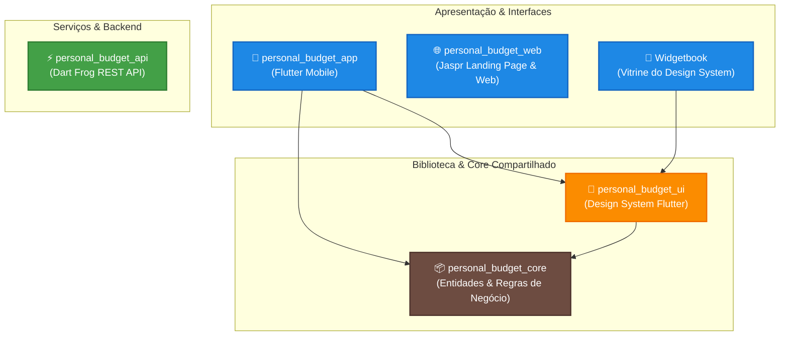

# Personal Budget Full-Stack Monorepo

Este é um monorepo Dart e Flutter estruturado com o **Melos**, contendo todos os sistemas integrados do gerenciador financeiro pessoal (Mobile, Web, API e Design System).

---

## 🔗 Links do Projeto

* **Landing Page:** [https://castrors.github.io/personal_budget_fullstack/](https://castrors.github.io/personal_budget_fullstack/)
* **Widgetbook (Catálogo do Design System):** [https://castrors.github.io/personal_budget_fullstack/widgetbook/](https://castrors.github.io/personal_budget_fullstack/widgetbook/)

---

## 🏗️ Organograma de Arquitetura

Abaixo está o diagrama representativo da organização dos módulos e dependências do projeto. A arquitetura é separada em camadas de apresentação (Frontend), serviços de API (Backend) e bibliotecas compartilhadas (Design System e Core de Domínio).



---

## 📦 Pacotes do Monolito

O repositório está subdividido no diretório `packages/` com as seguintes responsabilidades:

| Pacote | Tipo | Descrição |
| :--- | :--- | :--- |
| [`personal_budget_core`](file:///Users/de-souza-castror/Projects/personal/personal_budget_fullstack/packages/personal_budget_core) | Pure Dart | Regras de negócio essenciais, enums de categorias/tipos e modelos de dados comuns (ex: `Transaction`). |
| [`personal_budget_ui`](file:///Users/de-souza-castror/Projects/personal/personal_budget_fullstack/packages/personal_budget_ui) | Flutter | Design System central contendo componentes visuais customizados (botões, cards, chips, navegação) e o tema central. [Ver Widgetbook Live ↗](https://castrors.github.io/personal_budget_fullstack/widgetbook/) |
| [`personal_budget_app`](file:///Users/de-souza-castror/Projects/personal/personal_budget_fullstack/packages/personal_budget_app) | Flutter App | Aplicativo nativo mobile principal (Android/iOS) que consome o Design System e implementa as telas de fluxo financeiro. |
| [`personal_budget_web`](file:///Users/de-souza-castror/Projects/personal/personal_budget_fullstack/packages/personal_budget_web) | Jaspr (Web) | Landing Page pública construída com Jaspr (compilada de forma estática para publicação otimizada via GitHub Pages). |
| [`personal_budget_api`](file:///Users/de-souza-castror/Projects/personal/personal_budget_fullstack/packages/personal_budget_api) | Dart Frog | Servidor de endpoints REST estruturado com Dart Frog para provisionar persistência e integração com bancos de dados. |

---

## 🛠️ Como Executar o Workspace

O projeto utiliza o **Melos** para gerenciar dependências e comandos cruzados.

### Pré-requisitos
Certifique-se de possuir o Flutter SDK e o Dart SDK instalados e o Melos ativado globalmente:
```bash
dart pub global activate melos
```

### 1. Inicializar o Workspace (Bootstrap)
Configure os links simbólicos e baixe as dependências de todos os sub-pacotes de forma integrada:
```bash
melos bootstrap
```

### 2. Comandos Disponíveis (Melos Scripts)
Os seguintes scripts estão disponíveis a partir da raiz do monorepo:

* **Análise estática de código (Linter):**
  ```bash
  melos run analyze
  ```
* **Executar os testes automatizados em lote:**
  ```bash
  melos run test
  ```
* **Rodar o servidor web Jaspr localmente (Modo Desenvolvimento):**
  ```bash
  melos run serve:web
  ```
* **Compilar a Landing Page estática para produção:**
  ```bash
  melos run build:web
  ```
